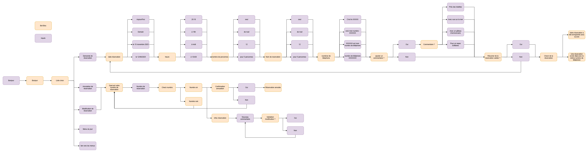
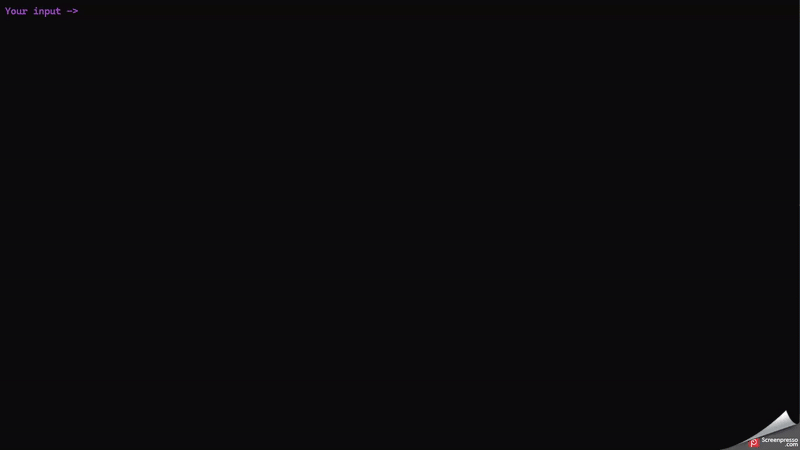

# Projet RASA - Bot de réservation de restaurant et d'hôtel

- CHANSON Tom
- LEGRAS Baptiste

## 🔄 Installation et lancement du projet

1. **Activer l'environnement virtuel :**
```bash
source ~/rasa/venv/bin/activate
```

2. **Lancer l'entrainement du bot :** 

```bash
rasa train
```

3. **Lancer l'action serveur :**

```bash
rasa run actions
```

4. **Lancer le bot :**

```bash
rasa shell
```

## 🗺️ Schéma du bot

Le schéma est dispo ici : 



## 🎥 Démo du scénario

Voici une démo pour la réservation sans commentaires : 



## 💡 Fonctionnalités principales
    
- **Réservation d'un restaurant** : Date, heure, nombre de personnes, nom, téléphone
    
- **Ajout de commentaire à une réservation**
    
- **Consultation du menu du jour** (via API externe)
    
- **Consultation du menu complet** (lien fixe)
    
- **Annulation d'une réservation**
    
- **Modification du commentaire d'une réservation existante**

- **Consultation des informations de réservation** : date, heure, nombre de personnes, nom, téléphone

## 📊 Flux conversationnels couverts
    
- **Flux Restaurant** : Réserver une table (avec ou sans commentaire)
    
- **Flux Annulation** : Annuler une réservation avec confirmation
    
- **Flux Modification** : Modifier un commentaire
    
- **Flux Menu** : Consulter le menu du jour ou la carte

- **Flux info** : Obtenir des informations sur sa réservation

## Intégration dans Slack

Pour des raisons de sécurité, les credentials de l'application Slack ne sont pas inclus dans le dépôt.


